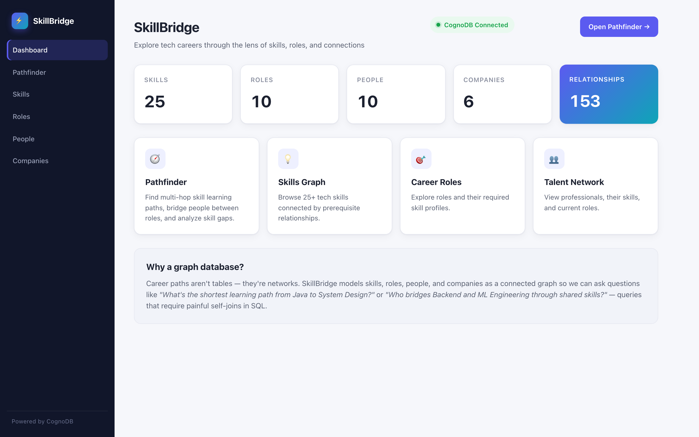
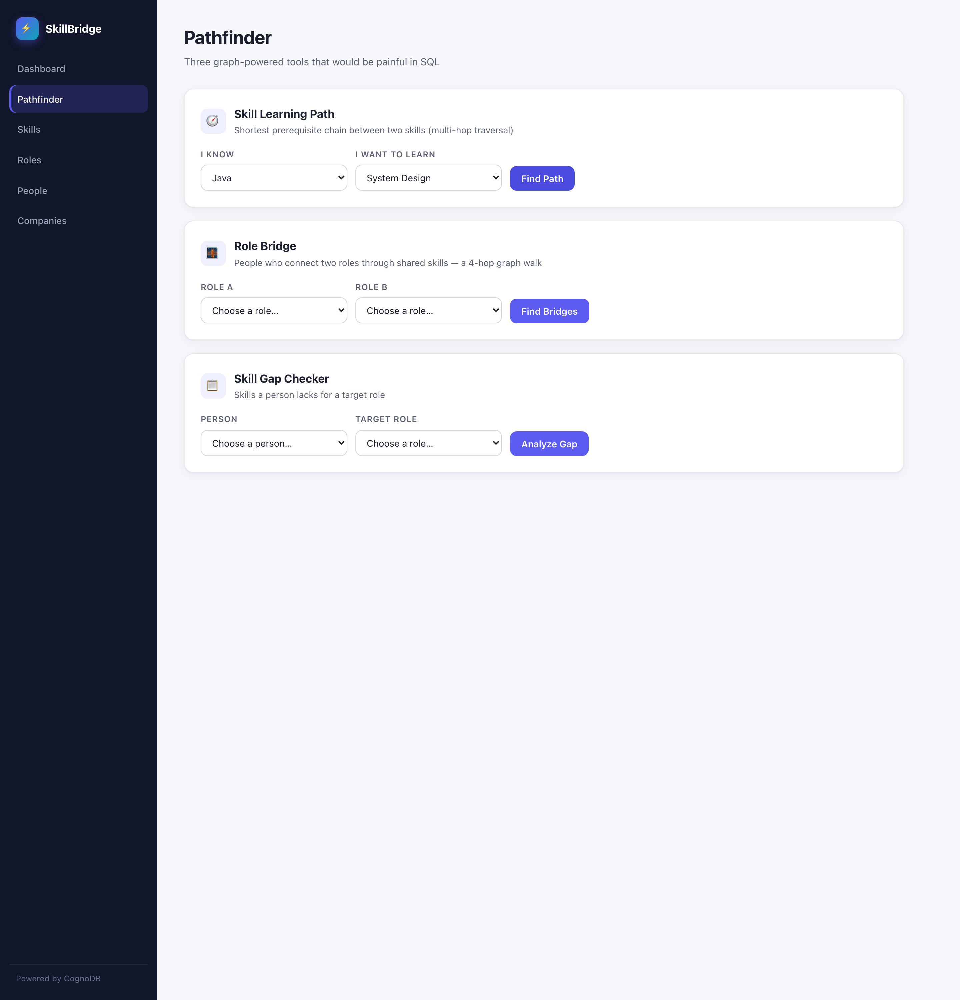
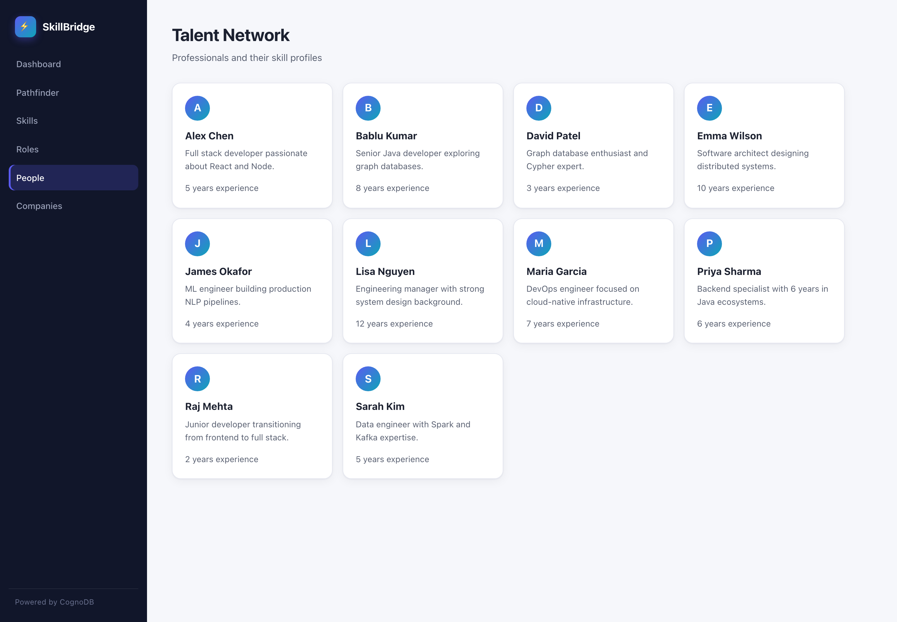
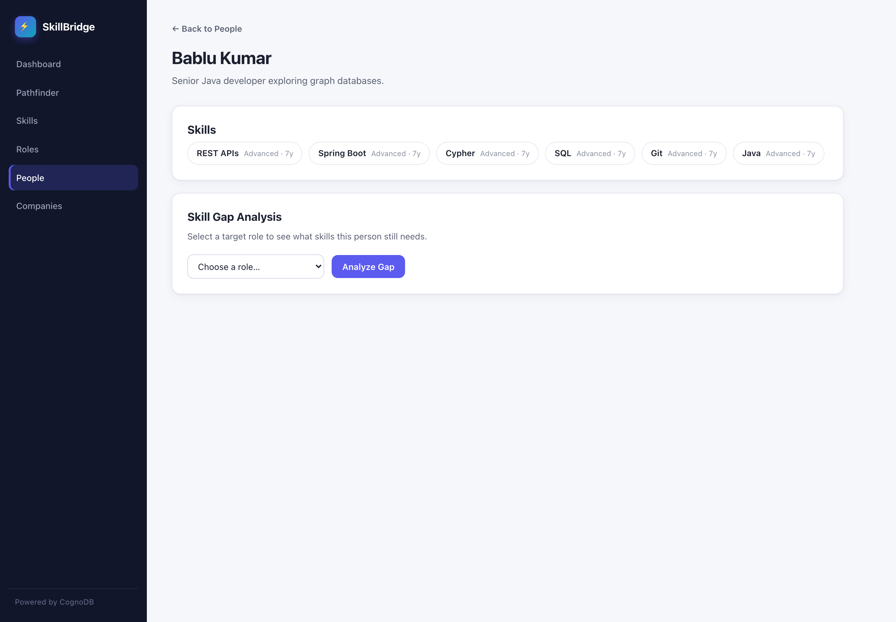
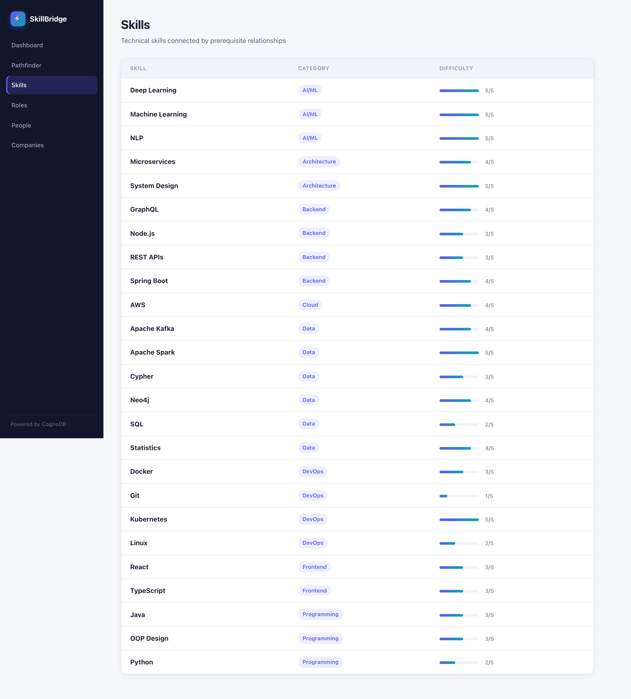

# SkillBridge Graph

A career-guidance app backed by **CognoDB**, a managed graph database that speaks openCypher over the Bolt protocol. SkillBridge lets you explore a talent ecosystem — people, skills, roles, and companies — through the connections between them, using three graph-native tools that a relational database would find awkward or deeply painful to express.

Built with **Java 17 + Spring Boot** and the official **Neo4j Java driver (5.x)**.

---

## Table of contents
- [Use case](#-use-case)
- [Why a graph database?](#-why-a-graph-database)
- [Data model](#-data-model)
- [Live demo](#-live-demo)
- [The interesting queries](#-the-interesting-queries)
- [Project structure](#-project-structure)
- [Getting started](#-getting-started)
- [Screenshots](#-screenshots)
- [Running against your own CognoDB instance](#-running-against-your-own-cognodb-instance)

---

## 🔎 Use case

**SkillPath / Career bridging.** When you're thinking about a career, the interesting questions are almost never "which row has a value" — they're about *paths and bridges*:

- *"What's the shortest chain of prerequisites from **Java** to **System Design**?"*
- *"Who at this company could already bridge a **Backend Engineer** role and an **ML Engineer** role through the skills they already hold?"*
- *"What specifically does **Bablu** lack before he can move into the **Graph Database Developer** role?"*

Each of these is naturally a **walk across a network**, not a join across tables. Representative query types include:
1. A **multi-hop traversal** — `shortestPath` over `PREREQUISITE_FOR` edges (2+ hops).
2. A **relational-awkward** query — finding people who connect two roles through shared skills via a 4-hop path.
3. A **skill-gap / subgraph-matching** query — matching a person's skill profile against a role's requirements.

---

## 🧠 Why a graph database?

A relational design for this data would need at least a handful of tables (`skills`, `roles`, `people`, `companies`) plus a web of join tables (`role_requires_skill`, `person_has_skill`, `person_works_as`, `company_employs`, `skill_prerequisite`). Every interesting question then becomes a chain of `JOIN`s with recursive CTEs — and the most interesting ones, exponential path enumeration and variable-depth traversal, are exactly where SQL offers no good native answer.

With a graph database (CognoDB), these become first-class, readable, constant-feeling Cypher patterns:

| Question | Relational (SQL) | Graph (Cypher) |
|---|---|---|
| Variable-depth prerequisite chain | Recursive CTE, hand-rolled `UNION` | `MATCH path = shortestPath((a)-[:PREREQUISITE_FOR*..8]->(b))` |
| People bridging two roles via shared skills | Many joins across join tables + dedupe; unclear | `MATCH (roleA)-[:REQUIRES]->(s)<-[:HAS_SKILL]-(p)-[:HAS_SKILL]->(t)<-[:REQUIRES]-(roleB)` |
| Profile matching / gaps | Set-difference of skill ids per person | Subgraph pattern match + `OPTIONAL MATCH` gap scoring |

The queries read close to how you'd describe the problem out loud. Traversals traverse; hops (`*..8`) are built in; and the cost model is tuned for walking the network, exactly what this data is.

I also chose a domain (careers/skills) where every entity's value comes from **the relationships around it** — an isolated skill, person, or role in a separate table carries far less meaning than the same node sitting in the talent network.

---

## 🕸️ Data model

```
                     ┌──────────────┐
                     │   (Skill)    │  id, name, category, difficulty
                     └──────────────┘
                           ▲
           PREREQUISITE_FOR {monthsToLearn}
                           │
                    ┌──────┼──────┐
                    │             │
          HAS_SKILL │             │ REQUIRES {proficiency}
         {prof,     │             │
          years}    │             ▼
                    │      ┌────────────┐
                    │      │  (Role)    │  id, title, level, domain
                    │      └────────────┘
                    │             ▲
                    ▼             │ WORKS_AS {since}
             ┌────────────┐       │
             │  (Person)  │───────┘  id, name, bio, yearsExperience
             └────────────┘
                    ▲
      EMPLOYS {since} │
             ┌───────┴────────┐
             │   (Company)    │  id, name, industry, location
             └────────────────┘
                    │ OFFERS_ROLE
                    ▼
               (Role)   (repeated from above)
```

The model is a **six-way** network with these labeled relationships:

- `(Skill)-[:PREREQUISITE_FOR {monthsToLearn}]->(Skill)` — learning order
- `(Person)-[:HAS_SKILL {proficiency, years}]->(Skill)` — what someone holds
- `(Person)-[:WORKS_AS {since}]->(Role)` — current role
- `(Role)-[:REQUIRES {proficiency}]->(Skill)` — what a role asks for
- `(Company)-[:EMPLOYS {since}]->(Person)` — where people work
- `(Company)-[:OFFERS_ROLE]->(Role)` — open positions

Every node carries a stable `id` used for parameterised lookups; labels and typed relationships give us the query surface described in the section above.

---

## 🚀 Live demo

- **App:** ~https://skillbridge.onrender.com~ — *(to be populated after the Render deploy)*
- **Screen recording:** `docs/demo.webm` — a ~30s walkthrough of the Pathfinder tools (learning path, role bridge, skill gap) in action.

---

## 🧮 The interesting queries

All queries are **parameterised** (no string-concatenated Cypher). A few, as they appear in the code (`GraphRepository`):

**1. Multi-hop learning path (shortest path, ≥2 hops)** — *`findSkillLearningPath`*
```cypher
MATCH path = shortestPath(
  (start:Skill {id: $fromSkillId})-[:PREREQUISITE_FOR*..8]->(end:Skill {id: $toSkillId})
)
WITH nodes(path) AS skillNodes, relationships(path) AS rels
UNWIND range(0, size(skillNodes) - 1) AS idx
WITH idx, skillNodes[idx] AS s,
     CASE WHEN idx = 0 THEN 0 ELSE rels[idx-1].month END AS months
RETURN idx + 1 AS step, s.id, s.name, s.category, months
ORDER BY step
```

**2. Relational-awkward: people who bridge two roles** — *`findBridgePeopleBetweenRoles`*
```cypher
MATCH (roleA:Role {id: $a})-[:REQUIRES]->(skill1)<-[:HAS_SKILL]-(person)
      -[:HAS_SKILL]->(skill2)<-[:REQUIRES]-(roleB:Role {id: $b})
WHERE skill1 <> skill2
  AND NOT (person)-[:WORKS_AS]->(roleA)
  AND NOT (person)-[:WORKS_AS]->(roleB)
RETURN person, [skill1, skill2], roleA, roleB
```
A SQL version needs several joins plus a self-referential dedupe — this is one Cypher traversal.

**3. Skill gap — profile matching** — *`findSkillGap`*
```cypher
MATCH (r:Role {id:$r})-[req:REQUIRES]->(s:Skill)
OPTIONAL MATCH (p:Person {id:$p})-[hs:HAS_SKILL]->(s)
RETURN s.id, s.name,
  CASE
    WHEN hs IS NULL THEN 'missing'
    WHEN hs.proficiency='beginner' AND req.proficiency='intermediate' THEN 'underqualified'
    ...
    ELSE 'met' END AS status
```

The dashboard's headline counts (`getDashboardStats`) also read across every node + relationship in the graph to show graph size at a glance.

### Compatibility notes (things I hit on CognoDB)

CognoDB's Cypher engine has a couple of quirks I worked around deliberately, and I documented them so reviewers know the code isn't sloppy:

1. **Filters on the second node of a comma-joined `MATCH` get dropped.** `MATCH (a:Skill {id:'x'}), (b:Skill {id:'y'}) CREATE (a)-[:R]->(b)` creates *every* `a→skill` edge in a batch. The seed therefore uses **two separate `MATCH` clauses** (or explicit `WHERE`) for every edge, and a comment in `seed-data.cypher` explains why.
2. **`NOT (x)-[:REL]->(y)` and `OPTIONAL MATCH` node filters misbehave in complex queries.** The role-bridge *exclusion* ("not already in either role") and the skill-gap *profile join* are computed in Java from simple single-pattern Cypher queries (`GraphRepository.findBridgePeopleBetweenRoles`, `findSkillGap`). The genuinely graph-native parts — the 4-hop bridge traversal and `shortestPath` — still run entirely in Cypher.

---

## 🗂 Project structure

```
skillbridge-graph/
├── pom.xml                        # Maven build; Java 17 + Neo4j driver 5.x
├── .env.example                   # Copy to `.env`; never commit real secrets
├── README.md
└── src/main/
    ├── java/com/skillbridge/
    │   ├── SkillBridgeApplication.java
    │   ├── config/               # CognoDbProperties, Neo4jConfig, AppProperties
    │   ├── repository/GraphRepository.java   # all Cypher lives here
    │   ├── service/GraphService.java         # thin business layer + input validation
    │   ├── controller/           # PageController (views), ApiController (JSON)
    │   ├── dto/                  # records (no frameworks needed)
    │   ├── exception/            # DatabaseUnavailableException + handler
    │   └── seed/                 # DataSeeder + SeedDataProvider
    └── resources/
        ├── application.yml       # env-var driven config
        ├── seed-data.cypher      # ← the actual seed "script" the app loads
        ├── static/css/style.css  # design system
        ├── static/js/app.js      # pathfinder interactivity
        └── templates/            # Thymeleaf views (index, skills, roles, …)
```

**Layering:** `Controller → Service → Repository` with a thin seam so the Cypher queries are isolated in one class (`GraphRepository`). Error handling maps driver `ServiceUnavailableException` → a friendly `DatabaseUnavailableException` rendered by the global handler into either a JSON 503 (for `/api/*`) or the error page.

---

## 🧰 Getting started

Requirements: **JDK 17+**, **Maven 3.8+**.

```bash
# 1. Clone the repo
git clone <your-repo-url>
cd skillbridge-graph

# 2. Create your env file from the template
cp .env.example .env        # then edit to add your CognoDB password

# 3. First run: seed the database, then run the app
export JAVA_HOME=$(/usr/libexec/java_home -v 17)   # or point at your JDK 17/21
SEED_DATA=true mvn spring-boot:run

# 4. Open the UI
open http://localhost:8080
```

> There is no checked-in Maven wrapper (`mvnw`) by design; use a system Maven 3.8+.

The Neo4j driver reads these values from the environment:

| Variable | Purpose | Example |
| --- | --- | --- |
| `COGNODB_URI` | `bolt+s://` endpoint of your CognoDB instance | `bolt+s://db-<id>.databases.cognodb.com` |
| `COGNODB_USERNAME` | your instance user (usually `cognodb`) | `cognodb` |
| `COGNODB_PASSWORD` | generated once during provisioning | keep in `.env` |
| `SEED_DATA` | load the demo graph on first boot | `true` once, then `false` |
| `PORT` | HTTP port | `8080` |

> On subsequent runs leave `SEED_DATA=false` (or let the app's `hasData()` check skip seeding — it's idempotent).

### Standalone seed
The seed graph is a plain Cypher file (`src/main/resources/seed-data.cypher`). You can run the same statements manually with any Bolt client (Neo4j Browser, `cypher-shell`, the Python/JS drivers) to load data without the app. The app's `DataSeeder` simply executes this file at startup.

---

## 📸 Screenshots

| | |
|:---:|:---:|
| **Dashboard** — live graph stats from CognoDB | **Pathfinder — skill learning path** |
|  |  |
| **Talent network** | **Person profile with skill-gap checker** |
|  |  |
| **Skills table** | |
|  | |

> The Pathfinder screenshot shows the multi-hop `shortestPath` result (Java → OOP Design → Spring Boot → Microservices → System Design).

---

## 🛠 Running against your own CognoDB instance

1. Sign up at [console.cognodb.com/signup](https://console.cognodb.com/signup) (no credit card required).
2. Create a free **c0** instance and pick a region.
3. Copy the connection URI (`bolt+s://<instance-id>.databases.cognodb.com`), username, and the **one-time password** into `.env`.
4. Run with `SEED_DATA=true`.

That's it — `GraphDatabase.driver(uri, AuthTokens.basic(user, password))` needs no SDK; the official Neo4j driver over Bolt handles the rest.

---

## 📄 License

MIT — do whatever you like, just reshore if you want to see it elsewhere. (Adjust to your taste.)